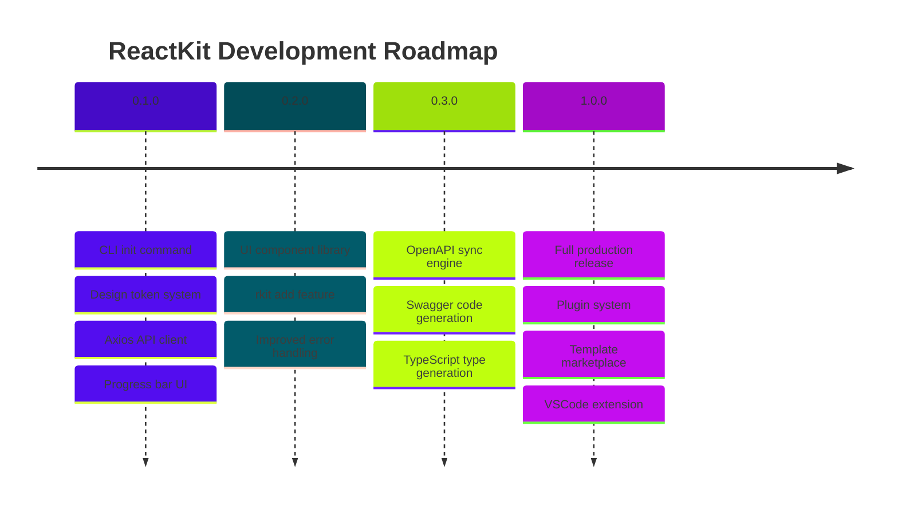

# Contributing to ReactKit

Thank you for considering contributing to ReactKit. This document provides guidelines for development setup, coding standards, and the pull request process.

---

## Table of Contents

- [Code of Conduct](#code-of-conduct)
- [Development Setup](#development-setup)
- [Project Structure](#project-structure)
- [Coding Standards](#coding-standards)
- [Pull Request Process](#pull-request-process)
- [Feature Roadmap](#feature-roadmap)
- [Getting Help](#getting-help)

---

## Code of Conduct

- **Be respectful** — every contributor deserves a positive experience
- **Focus on quality** — write clean, typed, well-documented code
- **Help others** — review pull requests, answer questions, share knowledge
- **No AI-generated bulk contributions** — each change should demonstrate understanding

---

## Development Setup

### Prerequisites

- Node.js >= 18.0.0
- npm >= 9.0.0

### Clone and Install

```bash
git clone <repository-url>
cd reactkit
npm install
```

### Development Workflow

```bash
# Terminal 1: Watch mode with auto-restart
npm run dev -- init --yes --output ./test-project

# Terminal 2: TypeScript checking
npm run typecheck

# Before committing
npm run build
npm test
npx rkit test
```

### Run the Self-Test

```bash
npx rkit test
```

This generates a temporary project, verifies the file structure, checks TypeScript compilation, installs dependencies, and runs a production build.

---

## Project Structure

```
reactkit/
├── src/
│   ├── index.ts                 # CLI entry point (Commander)
│   ├── commands/
│   │   ├── init.ts              # Project generation
│   │   └── test.ts              # Self-test command
│   ├── config/
│   │   ├── schema.ts            # Zod validation
│   │   └── builder.ts           # Config builder
│   ├── generators/
│   │   └── api-client.ts        # Axios client template builder
│   ├── templates/
│   │   └── styles/
│   │       ├── tokens.css.ts    # Design token CSS generator
│   │       └── base.css.ts      # Base styles CSS generator
│   ├── progress/
│   │   └── bar.ts               # CLI progress bar
│   ├── writer/
│   │   └── file-writer.ts       # Atomic file writer
│   ├── errors/
│   │   └── index.ts             # Error handling
│   └── utils/
│       └── names.ts             # Name converters
├── test/
├── package.json
├── tsconfig.json
├── vitest.config.ts
└── .gitignore
```

### Key Design Decisions

| Decision | Rationale |
|---|---|
| No `baseUrl` in tsconfig | Deprecated in TypeScript 7.0 — uses `paths` with relative resolution |
| String arrays for template builders | Avoids nested backtick hell in code generation files |
| Atomic file writes | Temp directory staging with rollback on failure |
| Progress bar over spinner | Clearer visual feedback for multi-step CLI operations |
| CSS variables for design tokens | Tailwind for layout only — colors and design via CSS custom properties |
| Axios for API client | Interceptor pipeline, token refresh queue, error normalization |

---

## Coding Standards

### TypeScript

- **Strict mode** — `strict: true` in tsconfig
- **No `any` type** — use proper TypeScript types for all declarations
- **Explicit return types** — every function must have a typed return
- **Clean imports** — no unused imports, no circular dependencies

### Naming Conventions

| Concept | Convention | Example |
|---|---|---|
| Files | kebab-case | `file-writer.ts` |
| Classes | PascalCase | `FileWriter` |
| Functions | camelCase | `buildTokensCSS()` |
| Types and Interfaces | PascalCase | `DocifyConfig` |
| CSS variables | kebab-case | `--color-primary` |
| Constants | UPPER_SNAKE_CASE | `DOCIFY_VERSION` |

### Code Style

```typescript
// Preferred — named function export
export function buildTokensCSS(): string {
  return lines(
    ":root {",
    "  --color-primary: #3b82f6;",
    "}",
  );
}

// Avoid — arrow function default export
const buildTokensCSS = (): string => { /* ... */ };
export default buildTokensCSS;
```

### Module Structure

```
module-name/
├── index.ts          # Public exports
└── module-name.ts    # Implementation
```

Each file should have a single responsibility. If a file exceeds approximately 200 lines, consider splitting it into smaller modules.

---

## Pull Request Process

### 1. Find or Create an Issue

Check the issue tracker for existing work. If your change is new, create an issue first to discuss the approach before implementing.

### 2. Create a Branch

```bash
git checkout -b feat/your-feature-name
# or
git checkout -b fix/your-bug-fix
```

### 3. Make Changes

- Write clean, typed TypeScript
- Add tests for new functionality
- Update documentation where applicable
- Run `npm run typecheck` — must pass with zero errors
- Run `npm test` — all tests must pass
- Run `npx rkit test` — self-test must pass

### 4. Commit

Use conventional commit messages:

```bash
git commit -m "feat: add Button component with variant and size props"
```

| Prefix | Use Case |
|---|---|
| `feat:` | New feature |
| `fix:` | Bug fix |
| `docs:` | Documentation |
| `refactor:` | Code restructuring |
| `test:` | Tests |
| `chore:` | Maintenance, dependencies |

### 5. Push and Create Pull Request

```bash
git push origin feat/your-feature-name
```

Create a pull request on GitHub with:
- Clear title and description
- Screenshots or code samples for UI changes
- Links to related issues

### 6. Review Process

- Maintainers will review the pull request
- Address feedback with additional commits
- Once approved, a maintainer will merge

---

## Feature Roadmap



### Current Development Focus

1. **UI Component Library** — Building production-ready components: Button, Input, Modal, DataTable, Select, Tabs, Toast, Tooltip
2. **Feature Addition** — The `rkit add` command for adding features to existing projects
3. **OpenAPI Sync** — Parsing Swagger specifications to generate API clients, types, and features
4. **Error Boundaries** — Component-level error catching with fallback UIs

---

## Getting Help

- **Issues** — GitHub Issues for bugs and feature requests
- **Discussions** — GitHub Discussions for questions and ideas
- **Documentation** — README.md and the `docs/` directory

---

*Thank you for helping make ReactKit better.*
