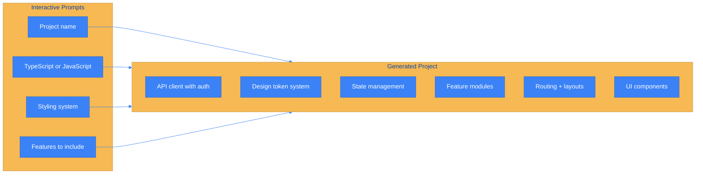
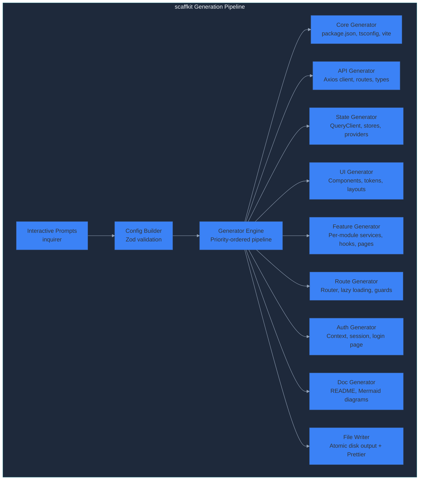
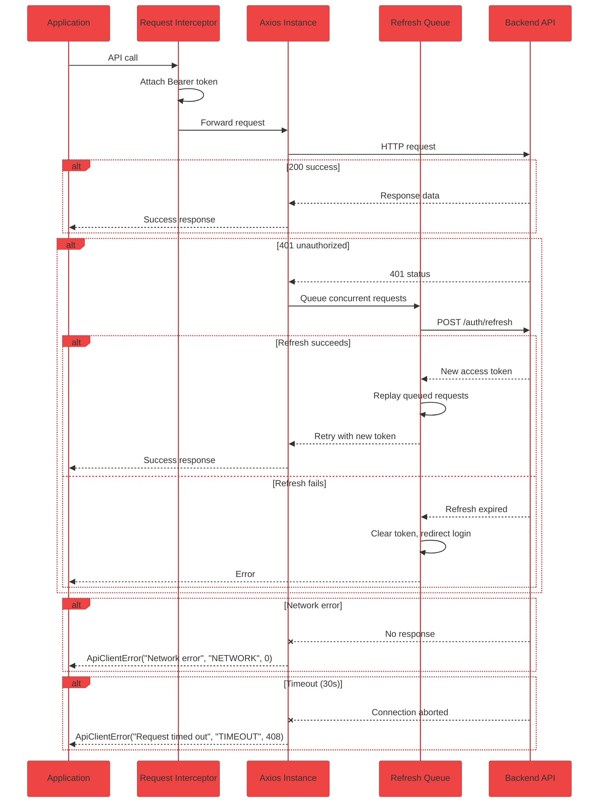

# scaffkit

[](https://www.npmjs.com/package/scaffkit)
[](LICENSE)
[](https://www.typescriptlang.org/)
[](https://github.com/Saksham21s/scaffkit)

**scaffkit** is an interactive CLI that generates production-grade React projects. It asks you a series of questions about your preferences, then builds a complete application with API client, design tokens, state management, routing, and feature modules — all wired together and ready to run.



---

## Quick Start

```bash
npx scaffkit init
```

The CLI will ask you a series of questions about your project preferences. Answer them, and within seconds you will have a complete, production-ready React application.

To skip prompts and use defaults:

```bash
npx scaffkit init --yes --output my-app
cd my-app
npm run dev
```

---

## Interactive Prompts

When you run `npx scaffkit init` without the `--yes` flag, the CLI presents a series of interactive prompts:

| Prompt | Options | Default |
|---|---|---|
| Project name | Text input | `my-app` |
| TypeScript or JavaScript | TypeScript / JavaScript | TypeScript |
| Styling system | Tailwind CSS / Custom CSS / CSS Modules | Tailwind CSS |
| Target platforms | Web / Mobile / Both | Web |
| State management | Zustand + TanStack Query / Redux Toolkit / Context only | Zustand + TanStack Query |
| Include authentication | Yes / No | Yes |
| Include routing | Yes / No | Yes |
| Include testing setup | Yes / No | Yes |
| Feature modules | Multi-select: auth, dashboard, users, settings | auth, dashboard, users |

Each answer dynamically changes the generated output. Choosing JavaScript gives you `.jsx` files instead of `.tsx`. Choosing Custom CSS generates a complete design token system instead of Tailwind config.

---

## Generated Project

### Project Structure

```
my-app/
├── src/
│   ├── components/
│   │   ├── ui/                  # Button, Input, Modal, Select, DataTable, etc.
│   │   ├── layout/              # Sidebar, Header, AuthLayout
│   │   └── common/              # SearchBar, Breadcrumbs, EmptyState
│   ├── features/
│   │   ├── auth/                # Authentication module
│   │   │   ├── components/      # LoginForm, RegisterForm
│   │   │   ├── hooks/           # useAuth, useLogin, useRegister
│   │   │   ├── pages/           # LoginPage, RegisterPage
│   │   │   ├── services/        # authService
│   │   │   ├── constants/       # route paths, roles
│   │   │   └── types/           # User, LoginPayload
│   │   ├── dashboard/
│   │   └── users/
│   ├── shared/
│   │   ├── core/
│   │   │   ├── api/             # Axios client, interceptors, routes
│   │   │   ├── auth/            # Session service, token management
│   │   │   ├── context/         # Theme, Notification, Layout providers
│   │   │   └── components/      # Providers, ErrorBoundary
│   │   ├── hooks/               # useDebounce, useLocalStorage, useModal
│   │   ├── lib/                 # cn, queryClient, store factory
│   │   ├── utils/               # format, notify, export
│   │   ├── constants/           # Status, roles, icons
│   │   ├── routes/              # Router config with lazy loading
│   │   └── styles/              # tokens.css, base.css, animations.css
│   ├── App.tsx
│   └── main.tsx
├── .env.example
├── index.html
├── package.json
├── tsconfig.json
├── vite.config.ts
└── tailwind.config.ts           # Only when Tailwind is chosen
```

### Architecture



### API Client



---

## CLI Commands

| Command | Description |
|---|---|
| `scaffkit init` | Start interactive project generation |
| `scaffkit init --yes --output <dir>` | Generate project with default options |
| `scaffkit test` | Run end-to-end self-test |
| `scaffkit add <feature>` | Add a feature to an existing project (coming) |
| `scaffkit sync <spec>` | Generate from OpenAPI spec (coming) |

---

## Tech Stack

| Layer | Technology |
|---|---|
| Framework | React 18 |
| Build | Vite 6 + TypeScript 5.7 |
| Styling | Tailwind CSS 3.4 / Custom CSS / CSS Modules |
| API Client | Axios with interceptor pipeline |
| Server State | TanStack Query 5 |
| Client State | Zustand 5 / Redux Toolkit / Context |
| Routing | React Router 6 with lazy loading |
| Icons | Lucide React |

---

## CLI Development

```bash
git clone https://github.com/Saksham21s/scaffkit.git
cd scaffkit
npm install

# Run the CLI directly (no build needed)
npm start init

# Skip prompts with defaults
npm start -- --yes --output ./my-app

# Or build and run from dist/
npm run preview init
```

---

## License

MIT.
