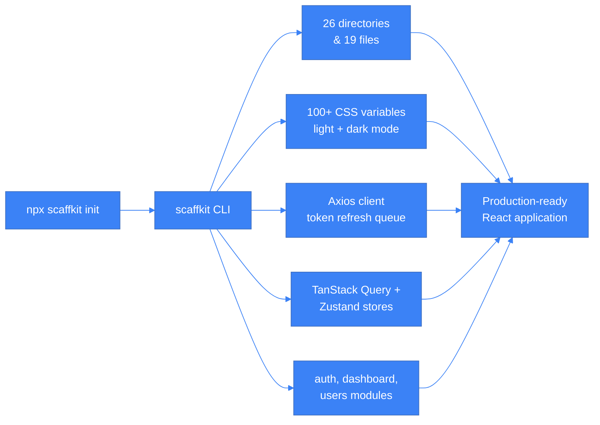
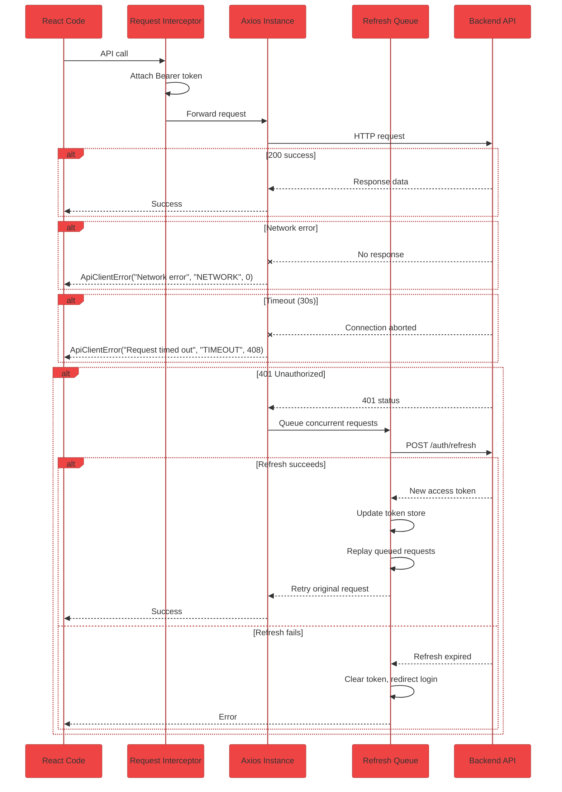

# scaffkit

[](https://www.npmjs.com/package/scaffkit)
[](LICENSE)
[](https://www.typescriptlang.org/)

**scaffkit is a CLI that generates production-grade React projects.** One command creates a complete application with API client, design tokens, state management, routing, and feature modules — all wired together and ready to run.



---

## Quick Start

```bash
npx scaffkit init --yes --output my-app
cd my-app
npm run dev
```

The process takes under 30 seconds. The generated project includes all dependencies installed and ready to develop.

**Without the `--yes` flag**, scaffkit prompts for project name, features, and options:

```bash
npx scaffkit init
```

---

## What You Get

Every generated project includes these systems, fully configured and integrated:

| System | What It Does |
|---|---|
| **Design Tokens** | 100+ CSS custom properties for colors, spacing, typography, shadows. Light and dark mode built in. All Tailwind utility classes mapped to these variables. |
| **API Client** | Axios instance with automatic Bearer token injection, token refresh queue (race-condition safe), 30s timeout, network error detection, and consistent error objects. |
| **State Management** | TanStack Query v5 for server state (caching, pagination, retry). Zustand v5 for client state (theme, sidebar, UI state). |
| **Feature Modules** | Independent modules for auth, dashboard, and users — each with components, hooks, pages, services, and types. |
| **Routing** | React Router v6 with lazy-loaded routes and Suspense boundaries. |
| **Build Setup** | Vite 6, TypeScript strict mode, path aliases (`@/`, `@shared/`, `@features/`), Tailwind 3.4, PostCSS. |

---

## CLI Commands

| Command | Description |
|---|---|
| `npx scaffkit init` | Generate a new React project |
| `npx scaffkit test` | Run end-to-end verification of the scaffkit toolchain |
| `npx scaffkit add <name>` | Add a feature module to an existing project (coming) |
| `npx scaffkit sync <spec>` | Generate features from OpenAPI/Swagger spec (coming) |

---

## Generated Project Structure

```
my-app/
├── src/
│   ├── components/
│   │   ├── ui/                  # Button, Input, Modal, Select, DataTable, etc.
│   │   └── layout/              # Sidebar, Header, AuthLayout
│   ├── features/
│   │   ├── auth/                # Login, register, session management
│   │   │   ├── components/
│   │   │   ├── hooks/
│   │   │   ├── pages/
│   │   │   ├── services/
│   │   │   └── types/
│   │   ├── dashboard/
│   │   └── users/
│   ├── shared/
│   │   ├── core/
│   │   │   └── api/             # Axios client + routes + interceptors
│   │   ├── lib/                 # cn(), queryClient, store
│   │   └── routes/              # Route configuration
│   └── styles/
│       ├── tokens.css           # CSS custom properties
│       ├── base.css             # Base element styles
│       └── index.css            # Entry point
├── .env.example
├── index.html
├── package.json
├── tsconfig.json
├── vite.config.ts
└── tailwind.config.ts
```

---

## API Client Architecture



The generated API client handles four scenarios automatically:

- **Token management** — JWT stored in localStorage, attached to every request via Axios interceptor
- **Concurrent 401 handling** — When multiple requests fail with 401, only one refresh call is made. All requests are queued and replayed once the new token arrives
- **Error normalization** — Every error is shaped as `ApiClientError { message, code, status }` regardless of source
- **Environment validation** — `VITE_API_BASE_URL` must be set at runtime or the app throws immediately (no silent fallback)

---

## Design Token System

Colors, spacing, typography, and shadows are defined as CSS custom properties — nothing is hardcoded. Tailwind is used for layout only (grid, flex, responsive). All Visual properties come from CSS variables:

```css
:root {
  --color-primary: #3b82f6;
  --color-primary-hover: #2563eb;
  --surface: #ffffff;
  --text: #0f172a;
  --border: #e2e8f0;
}

.dark {
  --surface: #0f172a;
  --text: #f1f5f9;
  --border: #334155;
}
```

The generated `tailwind.config.ts` maps every Tailwind utility to these variables, so `bg-primary`, `text-subtle`, and `border` all pull from the token system automatically.

---

## Tech Stack

| Layer | Technology |
|---|---|
| Framework | React 18 |
| Build | Vite 6 + TypeScript 5.7 |
| Styling | Tailwind CSS 3.4 + CSS Variables |
| API Client | Axios |
| Server State | TanStack Query 5 |
| Client State | Zustand 5 |
| Routing | React Router 6 |
| Icons | Lucide React |

---

## CLI Development

```bash
git clone <repo-url>
cd scaffkit
npm install
npm run build

# Run locally
npx tsx src/index.ts init --yes --output ./test-app

# Or link globally
npm link
scaffkit init
```

### Scripts

| Script | Purpose |
|---|---|
| `npm run dev` | Watch mode — auto-restart on file changes |
| `npm run build` | Build CLI to `dist/` using tsup |
| `npm run typecheck` | TypeScript check (zero errors required) |
| `npm test` | Run test suite |
| `npx scaffkit test` | End-to-end self-test (generates project, builds it, verifies output) |

---

## License

MIT.
