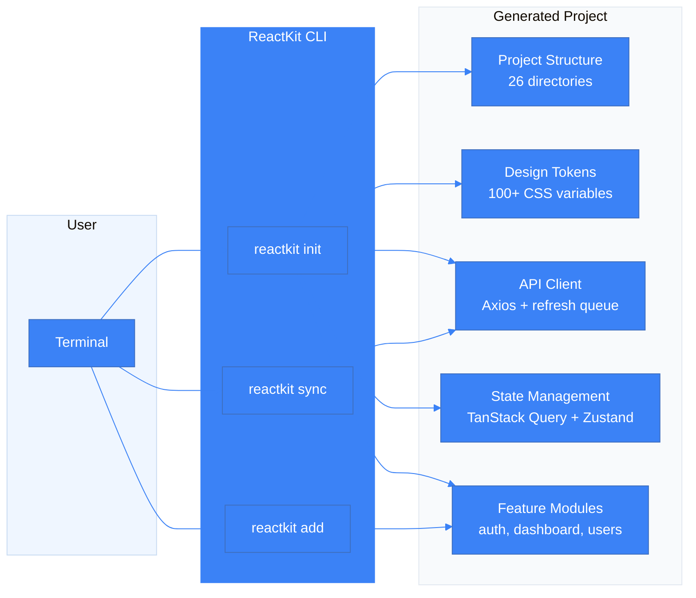
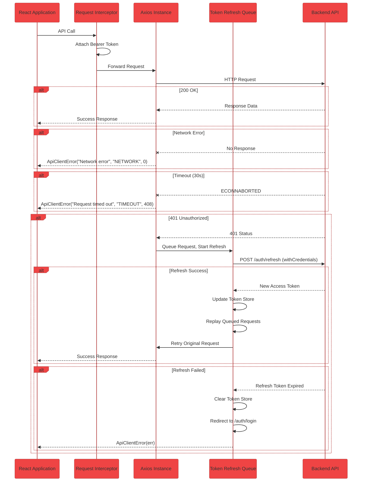
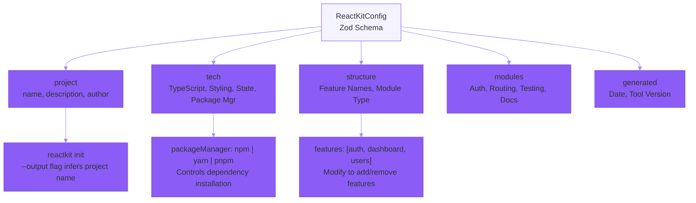
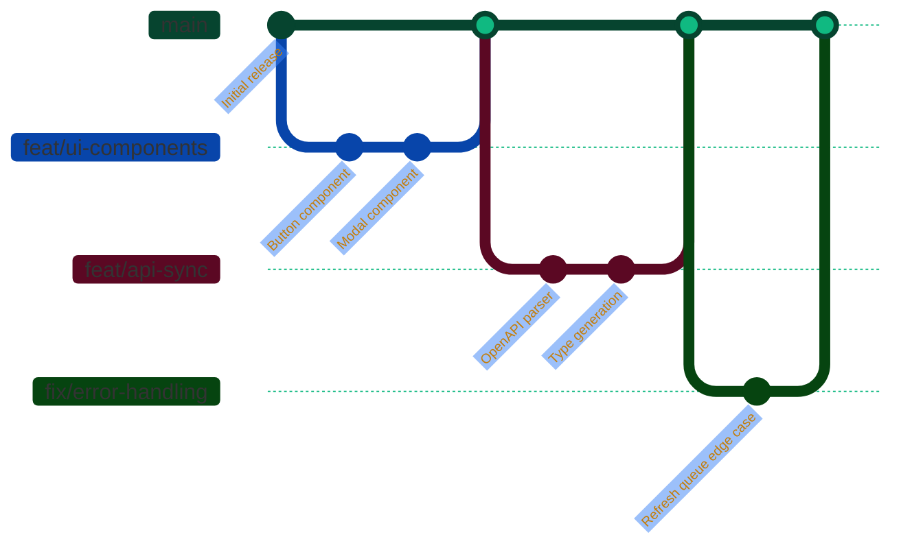

# ReactKit

[](https://www.npmjs.com/package/reactkit)
[](LICENSE)
[](https://www.typescriptlang.org/)
[](CONTRIBUTING.md)

**ReactKit** is a production-grade CLI scaffolding tool that generates complete React projects from a single command. It creates an entire application foundation — API client with auth interceptors, design token system, state management, routing, feature modules, and component library — following battle-tested patterns used in enterprise applications.

---

## Table of Contents

- [Overview](#overview)
- [Features](#features)
- [Quick Start](#quick-start)
- [CLI Commands](#cli-commands)
- [Generated Project](#generated-project)
  - [Project Structure](#project-structure)
  - [Architecture Overview](#architecture-overview)
  - [Design Token System](#design-token-system)
  - [API Architecture](#api-architecture)
  - [State Management](#state-management)
- [Tech Stack](#tech-stack)
- [Configuration](#configuration)
- [Development](#development)
- [Contributing](#contributing)
- [License](#license)

---

## Overview



ReactKit eliminates the hours spent configuring build tools, setting up API clients, designing token systems, and structuring feature modules. A single command produces a complete, build-ready project that follows a consistent, scalable architecture.

The generated project is not a simple boilerplate — it is a production foundation with environment variable validation, error boundaries, loading states, empty states, and responsive layout built-in.

---

## Features

```mermaid
%%{init: {'theme': 'base', 'themeVariables': { 'primaryColor': '#10b981', 'primaryTextColor': '#ffffff', 'lineColor': '#10b981'}}}%%
graph TD
    subgraph Core["Core System"]
        Direction LR
        C1["Zod Config<br/>Validation"]
        C2["Atomic File<br/>Writer"]
        C3["Progress<br/>Bar UI"]
    end
    
    subgraph Generated["Generated Project"]
        Direction LR
        G1["Design Token<br/>System"]
        G2["Axios API<br/>Client"]
        G3["Feature<br/>Modules"]
        G4["TanStack Query<br/>+ Zustand"]
        G5["React Router<br/>+ Lazy Loading"]
        G6["UI Component<br/>Library"]
    end
    
    C1 --> G1
    C2 --> G2
    C2 --> G3
    C2 --> G4
    C2 --> G5
    C2 --> G6
    
    style Core fill:#f0fdf4,stroke:#10b981
    style Generated fill:#f0fdf4,stroke:#10b981
```

| Capability | Details |
|---|---|
| **Zero-config setup** | One command generates a complete, build-ready project |
| **Design token system** | 100+ CSS custom properties with full light and dark mode support |
| **Production API client** | Axios with token refresh queue, timeout handling, error normalization |
| **Feature-based architecture** | Scalable module structure with services, hooks, pages, and types per feature |
| **State management** | TanStack Query for server state, Zustand for client state |
| **TypeScript strict mode** | Full type safety with path aliases configured for both tsconfig and Vite |
| **Environment validation** | Runtime check for required environment variables |
| **Dark mode ready** | All tokens and components support light and dark themes |
| **Self-test command** | `reactkit test` validates the entire generation pipeline |

---

## Quick Start

```bash
# Generate a new project
npx reactkit init

# Follow the prompts, or skip them with --yes
npx reactkit init --yes --output my-app

# Navigate to the project and start developing
cd my-app
npm run dev
```

The entire process completes in under 30 seconds. The generated project includes all dependencies installed and ready to run.

### Skip Prompts for CI or Automation

```bash
npx reactkit init --yes --output my-app
```

The `--yes` flag uses sensible defaults: TypeScript, Tailwind CSS with custom tokens, Axios API client, TanStack Query, Zustand, and feature modules for auth, dashboard, and users.

### Run the Self-Test

```bash
npx reactkit test
```

This command generates a temporary project, verifies the file structure, runs TypeScript compilation checks, installs dependencies, and executes a production build — all automatically. It validates that the entire pipeline works end-to-end.

---

## CLI Commands

| Command | Description | Status |
|---|---|---|
| `reactkit init` | Create a new React project with full production setup | Released |
| `reactkit add <name>` | Add a feature module to an existing project | In Development |
| `reactkit sync <spec>` | Parse OpenAPI/Swagger spec and generate features, types, and API client | In Development |
| `reactkit test` | Run end-to-end self-test to verify the CLI toolchain | Released |

All commands support `--help` for detailed usage information.

---

## Generated Project

### Project Structure

Every generated project follows a consistent, opinionated structure designed for teams and scalability.

```
my-app/
├── public/
├── src/
│   ├── components/
│   │   ├── ui/                  # Primitive components (Button, Input, Modal, Select, etc.)
│   │   └── layout/              # App shell components (Sidebar, Header, AuthLayout)
│   ├── features/
│   │   ├── auth/                # Authentication module
│   │   │   ├── components/      # Feature-specific UI
│   │   │   ├── hooks/           # Custom React hooks
│   │   │   ├── pages/           # Route-level page components
│   │   │   ├── services/        # API service layer
│   │   │   └── types/           # TypeScript types
│   │   ├── dashboard/
│   │   └── users/
│   ├── shared/
│   │   ├── core/
│   │   │   ├── api/             # Axios client, routes, interceptors
│   │   │   ├── context/         # React context providers
│   │   │   └── components/      # Shared presentation components
│   │   ├── hooks/               # Global custom hooks
│   │   ├── lib/                 # Utility libraries (cn, queryClient, store)
│   │   ├── routes/              # Route configuration
│   │   └── utils/               # Helper functions
│   └── styles/
│       ├── tokens.css           # Design token CSS variables
│       ├── base.css             # Element-level base styles
│       └── index.css            # Main stylesheet entry point
├── .env.example                 # Environment variable template
├── index.html                   # Vite entry point
├── package.json                 # Dependencies and scripts
├── postcss.config.js            # PostCSS with Tailwind + Autoprefixer
├── tailwind.config.ts           # Tailwind configuration mapping to CSS variables
├── tsconfig.json                # TypeScript strict configuration
└── vite.config.ts               # Vite with React plugin and path aliases
```

The feature-based architecture keeps related code colocated — each feature has its own components, hooks, pages, services, and types. This prevents cross-feature coupling and makes it easy to add, remove, or isolate features.

### Architecture Overview

```mermaid
%%{init: {'theme': 'base', 'themeVariables': { 'primaryColor': '#3b82f6', 'secondaryColor': '#8b5cf6', 'tertiaryColor': '#06b6d4', 'lineColor': '#94a3b8'}}}%%
graph TD
    subgraph CLI["ReactKit CLI"]
        CLI_Entry["index.ts<br/>Commander Entry"] --> InitCmd["init.ts<br/>Project Generator"]
        InitCmd --> Config["config/builder.ts<br/>Config Builder"]
        InitCmd --> Writer["writer/file-writer.ts<br/>Atomic File Writer"]
        InitCmd --> Progress["progress/bar.ts<br/>Progress Bar"]
        InitCmd --> Tokens["templates/styles/<br/>Design Token Builder"]
        InitCmd --> API["generators/api-client.ts<br/>Axios Client Builder"]
    end
    
    subgraph Project["Generated Project"]
        Direction LR
        P1["App.tsx<br/>Root Component"] --> P2["BrowserRouter<br/>React Router"]
        P1 --> P3["QueryClientProvider<br/>TanStack Query"]
        P2 --> P4["AuthPages<br/>Login, Register"]
        P2 --> P5["DashboardPages<br/>Main Views"]
        P4 --> P6["auth Service<br/>Axios Calls"]
        P5 --> P7["CRUD Services<br/>Per Feature"]
        P6 --> P8["api/client.ts<br/>Axios Instance"]
        P7 --> P8
        P8 --> P9["routes.ts<br/>API Routes"]
        P8 --> P10["Interceptor<br/>Token Refresh Queue"]
    end
    
    Writer -.-> Project
    API -.-> P8
    Tokens -.-> P11["styles/tokens.css<br/>CSS Variables"]
    
    style CLI fill:#1e293b,color:#f1f5f9
    style Project fill:#0f172a,color:#f1f5f9
    style P11 fill:#06b6d4,color:#ffffff
```

### Design Token System

ReactKit uses a **Tailwind + Custom CSS hybrid** approach. Tailwind is used exclusively for layout utilities — grid, flex, spacing, and responsive breakpoints. All colors, typography, shadows, and visual properties are defined as CSS custom properties, ensuring consistency across the application.

```css
:root {
  /* Core palette */
  --color-primary: #3b82f6;
  --color-primary-hover: #2563eb;
  --color-primary-active: #1d4ed8;
  --color-primary-subtle: #eff6ff;

  --color-secondary: #8b5cf6;
  --color-secondary-hover: #7c3aed;

  --color-tertiary: #06b6d4;
  --color-tertiary-hover: #0891b2;

  /* Semantic colors */
  --color-success: #10b981;
  --color-warning: #f59e0b;
  --color-error: #ef4444;
  --color-info: #3b82f6;

  --color-success-bg: #d1fae5;
  --color-warning-bg: #fef3c7;
  --color-error-bg: #fee2e2;
  --color-info-bg: #dbeafe;

  /* Surfaces */
  --surface: #ffffff;
  --surface-subtle: #f8fafc;
  --surface-muted: #f1f5f9;
  --surface-inverse: #0f172a;

  /* Text */
  --text: #0f172a;
  --text-subtle: #475569;
  --text-muted: #94a3b8;
  --text-inverse: #ffffff;

  /* Borders */
  --border: #e2e8f0;
  --border-strong: #cbd5e1;

  /* Typography */
  --font-sans: "Inter", system-ui, -apple-system, sans-serif;
  --font-mono: "JetBrains Mono", "Fira Code", monospace;

  /* Spacing, Radii, Shadows, Transitions, Z-index, Chart colors... */
}

.dark {
  --color-primary-hover: #60a5fa;
  --color-primary-active: #93c5fd;
  --color-primary-subtle: #172554;
  --surface: #0f172a;
  --surface-subtle: #1e293b;
  --surface-muted: #334155;
  --surface-inverse: #ffffff;
  --text: #f1f5f9;
  --text-subtle: #94a3b8;
  --text-muted: #64748b;
  --border: #334155;
  --border-strong: #475569;
}
```

The generated `tailwind.config.ts` maps every Tailwind utility to these CSS variables, so `bg-primary`, `text-subtle`, `border`, and `shadow-lg` all pull from the token system automatically.

### API Architecture



The generated API client provides:

- **Automatic token injection** — Bearer token is attached to every request via an Axios interceptor
- **Token refresh queue** — When a 401 response is received, the client queues all concurrent requests, performs a single refresh call, and replays the entire queue with the new token
- **Timeout handling** — Configurable timeout (default 30 seconds) with clear error messaging
- **Network error detection** — Distinguishes between network failures, timeouts, and server errors
- **Error normalization** — All errors are normalized to a consistent `ApiClientError` shape with code, status, and message
- **Centralized route configuration** — All API endpoints are defined in a single `routes.ts` file, per feature

### State Management

ReactKit generates a dual state management layer:

| Concern | Solution | When to Use |
|---|---|---|
| Server state (data fetching) | TanStack Query v5 | API calls, caching, pagination, optimistic updates |
| Client state (UI state) | Zustand v5 | Theme toggle, sidebar collapse, form state, modals |

The generated `queryClient.ts` configures sensible defaults:

```typescript
import { QueryClient } from "@tanstack/react-query";

export const queryClient = new QueryClient({
  defaultOptions: {
    queries: {
      staleTime: 30_000,           // 30 seconds before refetch
      gcTime: 5 * 60_000,          // 5 minutes in cache
      retry: 1,                    // Retry once on failure
      refetchOnWindowFocus: false,  // Don't refetch on tab switch
    },
  },
});
```

---

## Tech Stack

| Layer | Technology | Version |
|---|---|---|
| Framework | React | 18.3+ |
| Build Tool | Vite | 6.0+ |
| Language | TypeScript | 5.7+ (strict mode) |
| Styling | Tailwind CSS + CSS Custom Properties | 3.4+ |
| API Client | Axios | 1.7+ |
| Server State | TanStack Query | 5.62+ |
| Client State | Zustand | 5.0+ |
| Routing | React Router | 6.28+ |
| Icons | Lucide React | 0.460+ |
| CSS Utility | clsx | 2.1+ |

---

## Configuration

ReactKit uses a Zod-validated configuration schema. When you run `reactkit init`, the CLI builds a configuration object that controls every aspect of the generated project.



---

## Development

### Prerequisites

- Node.js >= 18.0.0
- npm >= 9.0.0

### Setup

```bash
git clone <repository-url>
cd reactkit
npm install
npm run build
```

### Available Scripts

| Script | Description |
|---|---|
| `npm run dev` | Watch mode — auto-restart CLI on file changes |
| `npm run build` | Build with tsup (ESM, minified, 23KB output) |
| `npm start` | Run the built CLI from `dist/` |
| `npm run typecheck` | TypeScript compilation check (zero errors required) |
| `npm test` | Run Vitest test suite |
| `npm run test:watch` | Vitest in watch mode |

### Project Structure

```
src/
├── index.ts                  # CLI entry point (Commander setup)
├── commands/
│   ├── init.ts               # Project generation command
│   └── test.ts               # Self-test command
├── config/
│   ├── schema.ts             # Zod validation schema
│   └── builder.ts            # Config builder
├── generators/
│   └── api-client.ts         # Axios template builder
├── templates/
│   └── styles/
│       ├── tokens.css.ts     # Design token template
│       └── base.css.ts       # Base styles template
├── progress/
│   └── bar.ts                # CLI progress bar
├── writer/
│   └── file-writer.ts        # Atomic file writer
├── errors/
│   └── index.ts              # Error handling
└── utils/
    └── names.ts              # Name converters
```

### Key Design Decisions

| Decision | Rationale |
|---|---|
| No `baseUrl` in tsconfig | Deprecated in TypeScript 7.0 — uses `paths` instead |
| String arrays for template builders | Avoids nested backtick hell — generates clean code |
| Atomic file writes | Temp directory staging with rollback on failure |
| Progress bar over spinner | Clearer visual feedback for multi-step operations |
| CSS variables for tokens | Tailwind for layout only — colors and design via CSS |

---

## Contributing

Contributions are welcome. Please read [CONTRIBUTING.md](CONTRIBUTING.md) for detailed guidelines on the development workflow, coding standards, and pull request process.



### Development Workflow

1. Fork the repository and create a feature branch
2. Run `npm run typecheck` — must pass with zero errors
3. Run `npm test` — all tests must pass
4. Run `npx reactkit test` — self-test must pass
5. Submit a pull request with a clear description

---

## License

MIT. See [LICENSE](LICENSE) for the full license text.

---

*ReactKit — One command. Complete React project. Production ready.*
